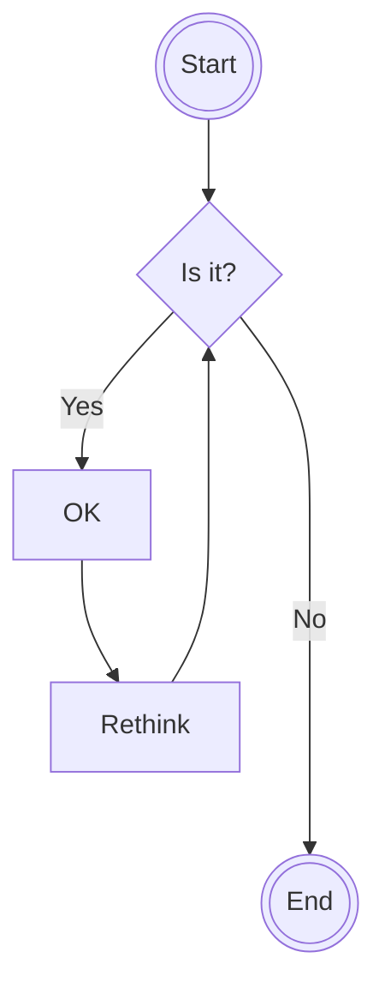
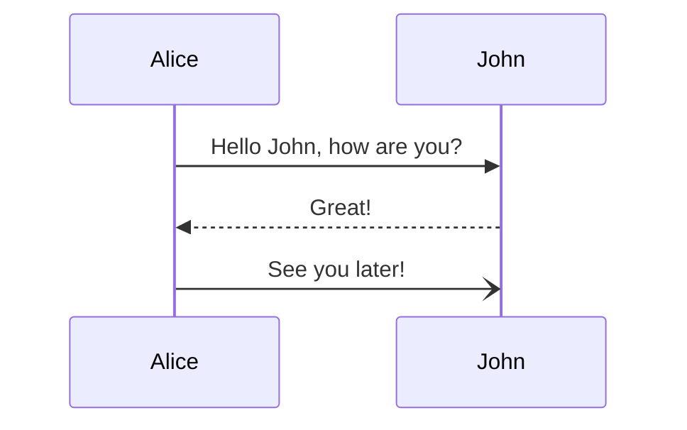
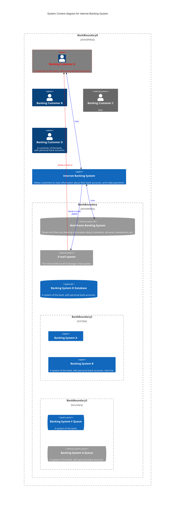

# High level documents of the system

## The document structure
All the HLDs should contain the next sections:
- Overview
- Functional requirements
- Non-functional requirements
- Solution
- Involved flows

_The additional requirements can be provided here_

## The diagrams can be used to describe your design
_The additional guidance can be provided here_

### Flow diagram:
_Description of use cases_

### Sequence diagram:
_Description of use cases_

### C4 model diagrams:
_Description of use cases_

