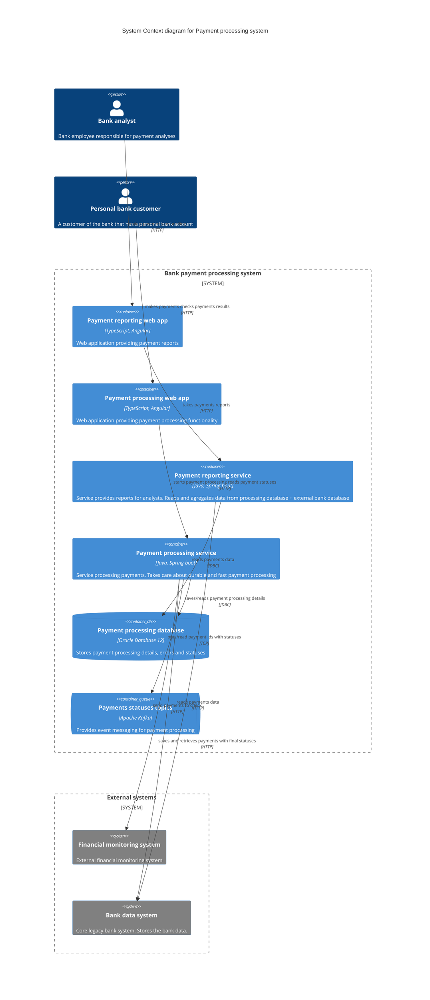
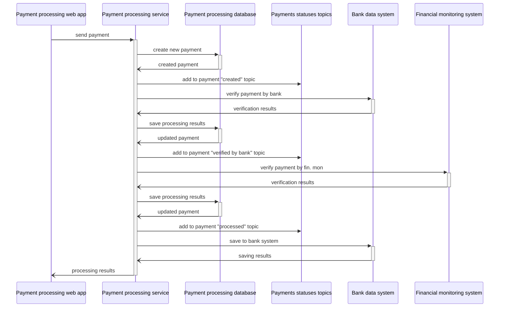
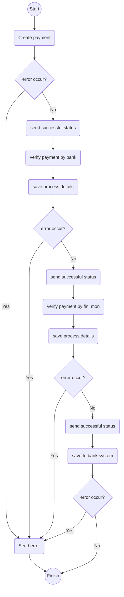

# Payment processing system design

## Overview
_System processing payments. 
Takes care about durable and fast payment processing. 
Service built to replace a legacy payment processing component._

## Functional requirements
Service should support a payment processing feature which contains next steps:
- Payment creation
- Bank verification of payment
- Financial monitoring of payment
- Tracing all the payment statuses changes and errors that may occur during the process

## Non-functional requirements
As a part of requirements service should support next non-functional features:
- **performance:** the latency of the service should be 1000ms (at least 50% smaller than in legacy systems). We should be notified about all the cases that cross this threshold.
- **durability:** payment process should be highly durable. Each payment status should be a save point from where the system should be able to continue the process. All the errors and unusual cases are reported.

## Solution

The service is called by payment processing web application, 
makes calls to bank data system, financial monitoring system, 
kafka message broker and its own database...

_The service is called by payment processing web application, makes calls to bank data system, financial monitoring system, kafka message broker and its own database._

## Involved flows

### Payment processing sequence:

1. User starts payments processing using web application 
2. Web application calls a processing method in payment processing service (PPS)
3. PPS saves the payment data in its database \
  3.1. If some error occur - PPS sends payment id, status and error message to error kafka topic and stops the flow. \
  3.2. If saving was successful - PPS sends payment id to a “created payments” kafka topic and go to “4.” 
4. PPS calls “verify payment” jdbc metod of “bank payment system” \
  4.1. If some error occur - PPS sends payment id, status and error message to error kafka topic and stops the flow. \
  4.2. If verification was successful - PPS sends payment id to a “verified by bank payments” kafka topic and go to “5.” 
5. PPS calls “verify payment” restmetod of “finantial monitoring system” \
  5.1. If some error occur - PPS sends payment id, status and error message to error kafka topic and stops the flow. \
  5.2. If verification was successful - PPS sends payment id to a “verified by financial monitoring payments” kafka topic and go to “6.” \

**TBD:** _to increase the process speed - we can make 4 and 5 in parallel. 6 in that case should wait until payment will be moved to “verified by bank and fin. mon.” status. #After_MVP_

6. PPS saves the payments in bank payment system using “save payment” jdbc method. \
  6.1. If some error occur - PPS sends payment id, status and error message to error kafka topic and stops the flow. \
  6.2. If savingwas successful - PPS stops the flow. \

**TBD:** _implement an “error listener” which will listen “error kafka topic” and based on the error message and payment status will make some actions on them (retry/ error notification/cancel etc.) #After_MVP__

### Payment processing service flow:

_Text description..._